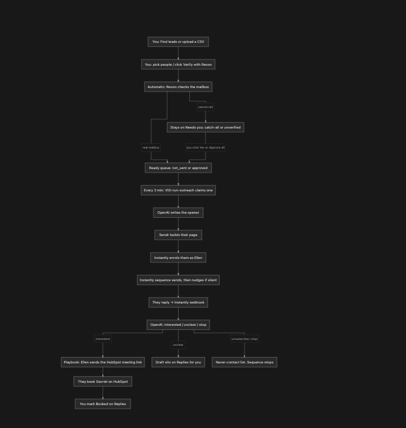

# VisioneerIT Outbound Engine

One reusable outbound engine for VisioneerIT products: **find the right people, keep only the reachable ones, write a personal opener, send email + LinkedIn, then hand a real reply to a human.**

OryonIQ (GovCon AI market intelligence) is the live pilot. Swap the config file and the same engine runs another VisioneerIT product. n8n orchestrates; OpenAI is the writing brain; **Supabase is the record**; the staff console is the dashboard. Google Sheets is retired.

Ellen sends the mail. Prospects meet Gavriel. Nothing is sent from a page view or a click.

## Staff console

This is the day-to-day board. It shows what the send loop will do next, what is waiting on a person, and where every lead sits.


The top card is the pipeline itself:

| Job | What it does |
|---|---|
| **Cold email** | `VIO-run-outreach` checks every 3 minutes. Only **Ready to send / Approved** people go out. |
| **Inbound replies** | Instantly webhook → OpenAI sentiment → Slack. A positive reply is a handoff, not a dial. |
| **Auto follow-up** | Optional playbook. If they sound interested, Ellen can send the meeting ask. Unclear stays a draft. |
| **Voice** | Disabled on purpose. A reply never places a call. |
| **VisioneerIT send** | Own Instantly campaign, or nothing. OryonIQ mail is never borrowed. |

Adding a lead does **not** email them. They wait on **Needs you** until someone confirms the person is real (or Reoon confirms the mailbox).


Cards on the board move on their own: Instantly send → **Already sent**, a reply → **Replied**, a booking → **Booked**. Staff can mark a person Hot / Later, suppress them, or open the ledger (every `events` row, newest first).

Screenshots use sample names. Live prospect data is not published here.

## How it works

You find or upload people. Reoon checks the mailbox. Only a real mailbox — or a person clicking **Yes** — reaches the send queue. n8n then claims one lead every 3 minutes, writes the opener, builds their page, and Instantly sends as Ellen. A reply is classified; interested gets the HubSpot link, unclear sits on Replies, stop goes on the never-contact list.



1. **Source** — Search Apollo for free (titles, seniority, US location, company size). Revealing an address is paid and capped; search never spends a credit. CSV upload and typed leads use the same gates.
2. **Gate** — Dedupe and suppression run *before* Reoon. A duplicate or a suppressed address costs nothing. A blank or unknown product is refused, not guessed.
3. **Human gate** — Catch-all or unverified stays on **Needs you**. Reoon `pass`, or you clicking Yes / Approve all, moves them to `not_sent` / `approved`.
4. **Send** — `VIO-run-outreach` claims one from `leads_ready` every 3 minutes. OpenAI writes the opener, Sendr builds the page, Instantly enrols them as Ellen, then the sequence nudges if they stay silent.
5. **Reply** — Instantly webhook → OpenAI classifies. Interested: Ellen sends the HubSpot meeting link (they book Gavriel). Unclear: a draft waits on Replies. Stop / unsubscribe: never-contact list, sequence ends. Voice never runs.

## Stack

| Piece | Role |
|---|---|
| **Apollo** | Source people. Search is free; reveal is paid and only for people you pick. |
| **Reoon** | Verify mailboxes. Catch-all → hold, invalid → drop. |
| **OpenAI** | Per-lead opener and reply sentiment. |
| **Instantly** | Email send + warmup. Four warmed `@getoryoniq.com` accounts, 120/day cap. |
| **Sendr** | LinkedIn + personalized page. One campaign/template per product. |
| **n8n** | Orchestration. Only `VIO-` workflows on the shared instance. |
| **Supabase** | The record: `leads`, append-only `events`, `replies`, `suppression`. |
| **Staff console** | Dashboard. The browser never holds the database key. |

## Two products, one engine

| Product | Config | Sendr campaign | Page template |
|---|---|---|---|
| OryonIQ | `reach-engine/config-oryoniq.json` | GovCon Capture/BD LinkedIn | GovCon Capture Page |
| VisioneerIT | `reach-engine/config-visioneerit.json` | Federal/SLED IT & Security LinkedIn | Zero-Trust Readiness Page |

## Repo map

| Path | What it is |
|---|---|
| `console/` | Staff console (Node, no npm deps) |
| `n8n-workflows/` | Live `VIO-*` workflow JSON + tests |
| `reach-engine/` | Python engine: source → reveal → verify → personalize |
| `supabase/` | Schema and migrations |
| `INTEGRATIONS.md` | Auth, endpoints, credential names, access board |
| `VISIONEERIT_BUILD_PLAN.md` | Phased plan, gates, abort criteria |

```bash
# Guided demo — no keys
python3 reach-engine/demo.py

# Console locally (needs .secrets.env, never committed)
export STAFF_PASSWORD=… SESSION_SECRET=…
node console/server.mjs
```

Secrets live in n8n's credential store and in `.secrets.env` on disk. They are never committed.

## Hard rules

- No automated voice. Thoughtly was skipped; there is no dial node.
- Inbound n8n webhooks are authenticated and fail closed.
- Suppression is append-only.
- A wrong product guess cannot be recalled — the console refuses a blank or unknown product instead.
